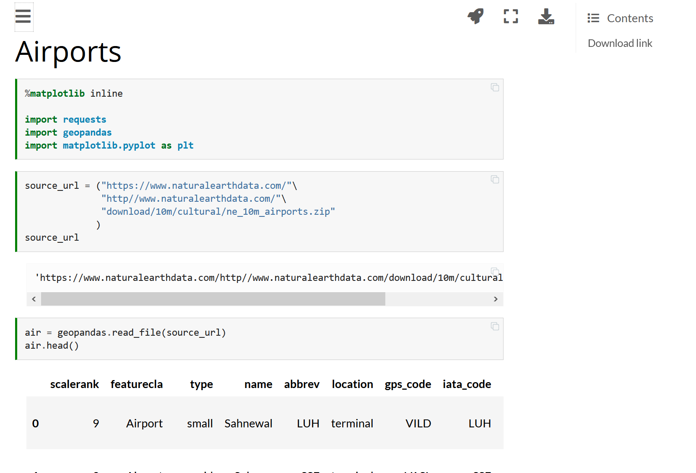
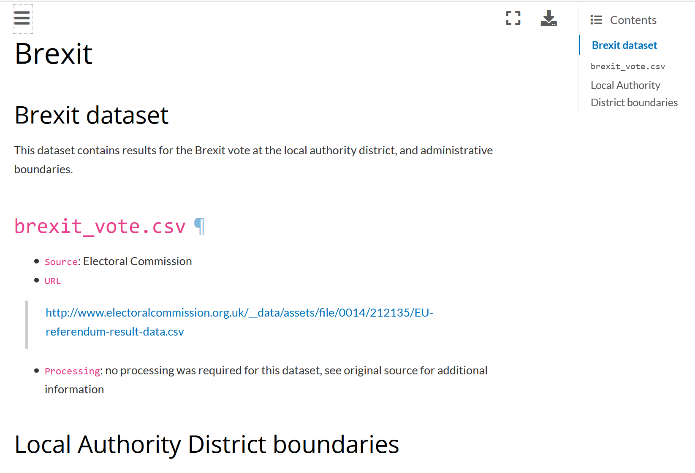
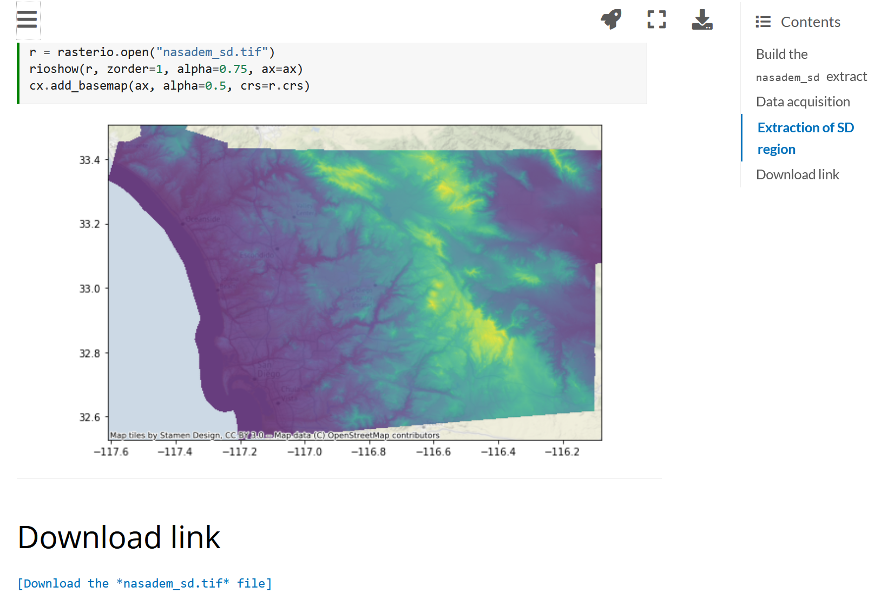

# Building "Geographic Data Science..."

<a href="http://darribas.org"><b>Dani Arribas-Bel</b></a>
<a href="http://twitter/com/darribas">[`@darribas`]</b></a>

<table>
<col width="33%">
<col width="33%">
<col width="33%">
<tr>
<td>

</td>
<td>

</td>
<td>

</td>
</tr>
</table>

#
## We have a book!

<iframe src="https://giphy.com/embed/LkjlH3rVETgsg" width="750" height="200" frameBorder="0" class="giphy-embed" allowFullScreen></iframe>
<a href="https://giphy.com/gifs/cat-book-reading-LkjlH3rVETgsg"><small>via GIPHY</small></a>

## Almost...

<iframe src="https://giphy.com/embed/R2m2NzVxQ3pbG" width="750" height="300" frameBorder="0" class="giphy-embed" allowFullScreen></iframe>
<a href="https://giphy.com/gifs/reactiongifs-R2m2NzVxQ3pbG"><small>via GIPHY</small></a>

Coming in 2021 but...

## Coming in 2021 but...

... you can already:

- &#x1F4D6; [`https://geographicdata.science`](https://geographicdata.science)
- &#x1F4BB; 
- &#x1F4A1; [`https://github.com/gdsbook/book`](https://github.com/gdsbook/book)

## The Authors

<table>
<col width="30%">
<col width="30%">
<col width="30%">
<tr>
<td>

[`@sreyog`](https://twitter.com/sreyog)

Serge Rey

</td>
<td>

[`@darribas`](https://twitter.com/darribas)

Dani Arribas-Bel

</td>
<td>

[`@levijohnwolf`](https://twitter.com/levijohnwolf)

Levi Wolf

</td>
</tr>
</table>

## The Book

## This Talk

- Why
- What
- How

#
## Why

##

&#x1F522; &#x1F4CA; &#x1F4C8; Data, data, data

 &#x1F4BE; &#x1F4BB; &#x1F916; Data Science 

 &#x1F4F1; &#x1F4E1; &#x1F30E; ...

</section><section id="batman" class="level2" data-background=../fig/batman.png data-background-size=contain data-transition=none>

## Geographic Data Science

&#x1F30E; &#x1F522; &#x1F916;

#
## What

## {data-background=../fig/toc.png data-background-size=contain data-transition=none}

## Building Blocks

<table>
<col width="70%">
<col width="30%">
<tr>
<td>

- Computational Environment
- Geographical Thinking
- Spatial Data
- Spatial Weights

</td>
<td>

</tr>
</table>

## Fundamentals

<table>
<col width="30%">
<col width="70%">
<tr>
<td>

<td>

- Choropleths
- Spatial Autocorrelation
- Local Spatial Autocorrelation
- Point Patterns

</td>
</tr>
</table>

## Advanced Topics

<table>
<col width="70%">
<col width="30%">
<tr>
<td>

- Spatial Inequality
- (Spatial) Unsupervised Learning
- Spatial Feature Engineering
- Spatial Modelling

</td>
<td>

</tr>
</table>

## Bonus: Datasets

<table>
<tr >
  <td>
    
  </td>
  <td>
    
  </td>
  <td>
    
  </td>
</tr>
<tr>
  <td>
    
  </td>
  <td>
    
  </td>
  <td>
    
  </td>
</tr>
<tr>
  <td>
    
  </td>
  <td>
    
  </td>
  <td>
    
  </td>
</tr>
</table>

#
## How

## Python

<a href="https://imgs.xkcd.com/comics/python.png">Source</a>

## Radically Open

<table>
<col width="30%">
<col width="30%">
<col width="30%">
<tr>
<td class='fragment'>

</td>
<td class='fragment'>

</td>
<td class='fragment'>

</td>
</tr>
</table>

## Code as text; text as codE

<table>
<col width="50%">
<col width="50%">
<tr>
<td>

</td>
<td class='fragment'>

</td>
</tr>
</table>

#
## Try it out!!!

# 
##

[[`PDF` version of these slides]](./index.pdf)

  GDS - The Book  is licensed under a <a rel="license" href="http://creativecommons.org/licenses/by-sa/4.0/">Creative Commons Attribution-ShareAlike 4.0 International License</a>.
