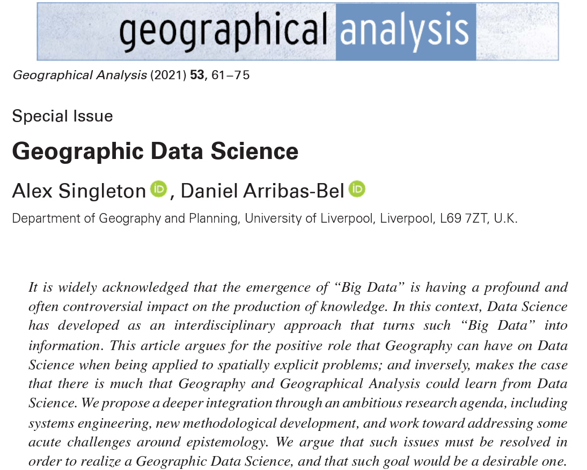
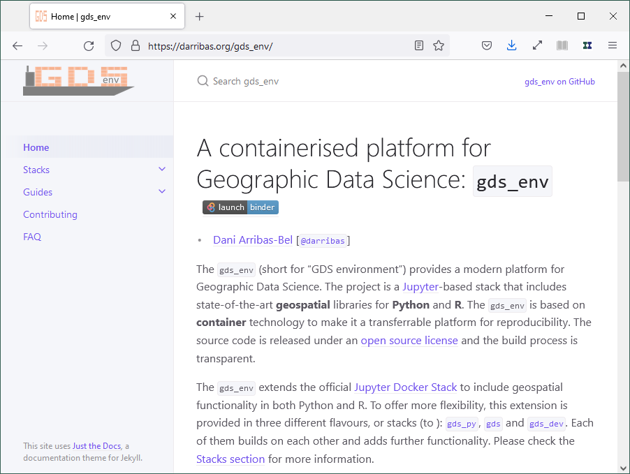
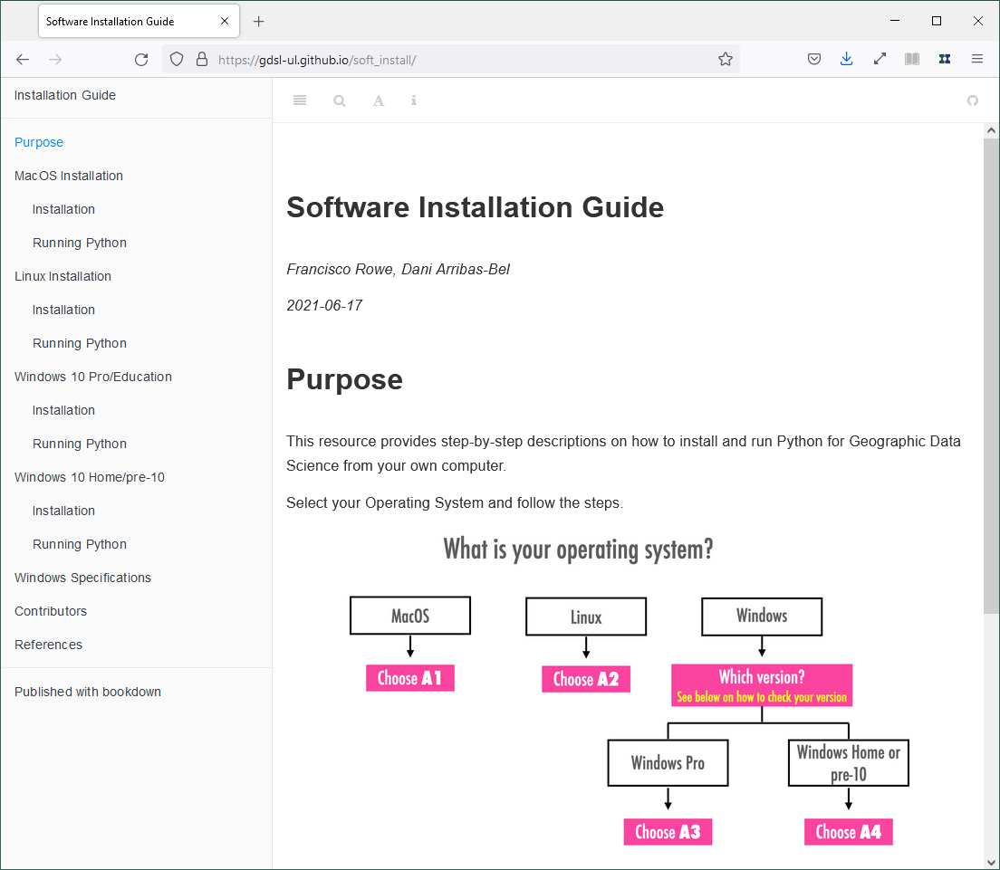

# *Geographic Data Science with Ptyhon*

<a href="http://darribas.org"><b>Dani Arribas-Bel</b></a>
<a href="http://twitter.com/darribas">[`@darribas`]</b></a>

<table>
<col width="33%">
<col width="33%">
<col width="33%">
<tr>
<td>

</td>
<td>

</td>
<td>

</td>
</tr>
</table>

#
## This talk

[`darribas.org/gdsbook_overview/202309_gdsl/`](https://darribas.org/gdsbook_overview/202309_gdsl/index.html)

#
## We have a book!

<iframe src="https://giphy.com/embed/LkjlH3rVETgsg" width="750" height="200" frameBorder="0" class="giphy-embed" allowFullScreen></iframe>
<a href="https://giphy.com/gifs/cat-book-reading-LkjlH3rVETgsg"><small>via GIPHY</small></a>

## You can *order* it...

<table>
<col width="50%">
<col width="50%">
<tr>
<td>

</td>
<td>

</td>
</tr>
</table>

## But also...

For free forever at:

- &#x1F4D6; [`https://geographicdata.science`](https://geographicdata.science)
- &#x1F4BB; 
- &#x1F4A1; [`https://github.com/gdsbook/book`](https://github.com/gdsbook/book)

## The Authors

<table>
<col width="30%">
<col width="30%">
<col width="30%">
<tr>
<td>

[`@sreyog`](https://twitter.com/sreyog)

Serge Rey

</td>
<td>

[`@darribas`](https://twitter.com/darribas)

Dani Arribas-Bel

</td>
<td>

[`@levijohnwolf`](https://twitter.com/levijohnwolf)

Levi Wolf

</td>
</tr>
</table>

## Today

- *Why?* - Vision
- *What?* - Book
- *How?* - Community

#
## *Why?*

##

&#x1F522; &#x1F4CA; &#x1F4C8; Data, data, data

 &#x1F4BE; &#x1F4BB; &#x1F916; Data Science 

 &#x1F4F1; &#x1F4E1; &#x1F30E; ...

</section><section id="batman" class="level2" data-background=../fig/batman.png data-background-size=contain data-transition=none>

## Geographic Data Science

&#x1F30E; &#x1F522; &#x1F916;

<table>
<col width="70%">
<col width="30%">
<tr>
<td>

</td>
<td>

</tr>
</table>

#
## *What?*

## The Book is...

## The Book is *not*...

- A GIS starter
- An introduction to programming
- An in-depth volume (rather *in-breath*)

## The Book is for...

- Data Scientists who work on spatial problems
- GIScientists who want to "update"
- (Social) Scientists getting started in geospatial

## {data-background=../fig/toc.png data-background-size=contain data-transition=none}

#
## *How?*

## Python

<a href="https://imgs.xkcd.com/comics/python.png">Source</a>

## Radically Open

<table>
<col width="30%">
<col width="30%">
<col width="30%">
<tr>
<td class='fragment'>

</td>
<td class='fragment'>

</td>
<td class='fragment'>

</td>
</tr>
</table>

## Code as text; text as codE

<table>
<col width="50%">
<col width="50%">
<tr>
<td>

</td>
<td class='fragment' data-fragment-index='1'>

</td>
</tr>
</table>

## Runs *anywhere*...

<table>
<col width="70%">
<col width="30%">
<tr>
<td>

`darribas.org/gds_env`

</td>
<td>

</tr>
</table>

## ... by *anyone*

<table>
<col width="70%">
<col width="30%">
<tr>
<td>

</td>
<td>

</tr>
</table>

`gdsl-ul.github.io/soft_install`

#
## Try it out...

#
## ...and make it better!!!

`github.com/gdsbook/book/issues/new`

# *Geographic Data Science with Ptyhon*

<a href="http://darribas.org"><b>Dani Arribas-Bel</b></a>
<a href="http://twitter.com/darribas">[`@darribas`]</b></a>

<table>
<col width="33%">
<col width="33%">
<col width="33%">
<tr>
<td>

</td>
<td>

</td>
<td>

</td>
</tr>
</table>

# 
##

  These slides  are licensed under a <a rel="license" href="http://creativecommons.org/licenses/by-sa/4.0/">Creative Commons Attribution-ShareAlike 4.0 International License</a>.
